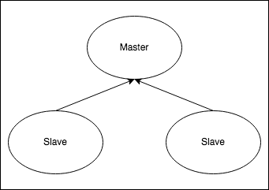
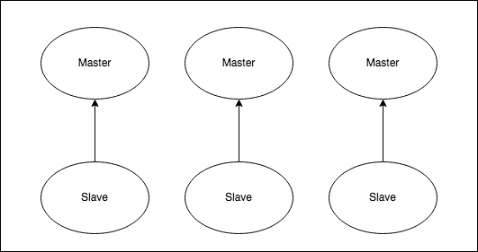

## Redis

[Redis](https://redis.io/topics/introduction) is an open source (BSD licensed), in-memory data structure store, used as a database, cache, and message broker. It is often referred to as a data structure server since keys can contain strings, hashes, lists, sets, sorted sets, bitmaps and hyperloglogs.

### Redis Helm Chart

The <a href="https://bitnami.com/stack/redis/helm">Bitnami Redis chart</a> bootstraps a Redis deployment on a Kubernetes cluster using the Helm package manager.

Bitnami charts can be used with Kubeapps for deployment and management of Helm Charts in clusters. This chart has been tested to work with NGINX Ingress, cert-manager, fluentd and Prometheus on top of the BKPR.

<h3>Two different charts are available for redis</h3>

1. <a href="https://github.com/bitnami/charts/tree/master/bitnami/redis">Redis Helm Chart</a> 
2. <a href="https://github.com/bitnami/charts/tree/master/bitnami/redis-cluster">Redis Cluster Helm Chart</a>

You can choose any of the two Redis Helm charts for deploying a Redis cluster. While Redis Helm Chart will deploy a master-slave cluster using Redis Sentinel, the Redis Cluster Helm Chart will deploy a Redis Cluster topology with sharding. The main features of each chart are the following:</ps>

<table>
  <tr>
    <th>Redis</th>
    <th>Redis Cluster</th>
  </tr>
  <tr>
    <td>Supports multiple databases</td>
    <td>Supports only one database. Better if you have a big dataset</td>
  </tr>
  <tr>
    <td>Single write point (single master)</td>
    <td>Multiple write points (multiple masters)</td>
  </tr>
  <tr>
    <td>  </td>
    <td>  </td>
  </tr>
</table>

Redis helm chart shall be explored in this tutorial

## Objective of tutorial

This course provides instructions to aid with the setup of Redis on [Kubernetes](http://kubernetes.io) using [Helm](https://helm.sh) package manager, including:
1. Deployment of a Redis database
2. Basic Redis commands
3. Connecting the deployed Redis database to a Nodejs Application.

## Prerequisites

- Kubernetes 1.12+
- Helm 3.0-beta3+

## Custom Configuration of Redis - Bitnami Helm chart

To deploy with custom configuration and explore the available paramaters visit https://github.com/bitnami/charts/tree/master/bitnami/redis/#parameters

